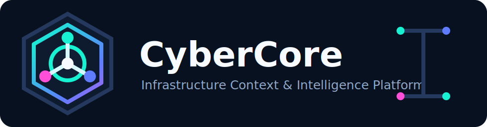

<div align="center">



> **Infrastructure Context & Intelligence Platform**  
> Technical descriptor: **AI-first Infrastructure Control Plane**
=======
# CYBERCORE


### Infrastructure Context & Intelligence Platform

**Observe reality. Build knowledge. Make safe decisions. Learn from outcomes.**

[](CHANGELOG.md)
[](ARCHITECTURE.md)
[](SECURITY.md)

</div>

---

## What is CyberCore?

CyberCore is an **open architecture and reference implementation for evidence-driven infrastructure intelligence**.

It models operational reality as a living system of **entities, relationships, events, evidence, decisions, actions, and memory**. Instead of automating first and explaining later, CyberCore builds an explicit world model, reasons over trusted evidence, and keeps humans in control of every meaningful mutation.

CyberCore is currently developed as the control and intelligence layer for the Eimy Herrer / CyberDJS infrastructure ecosystem, with an initial focus on InterServer-hosted services, shared hosting, VPS, DirectAdmin, mail, DNS, WordPress, Nextcloud, and selected applications.

## Why CyberCore exists

Infrastructure usually becomes risky before it becomes unavailable.

Ownership becomes unclear. Documentation drifts. Decisions lose context. Monitoring produces data without understanding. Automation grows faster than confidence.

CyberCore is designed to answer:

- What exists?
- Why does it exist?
- What changed?
- What evidence supports the current state?
- What is risky, obsolete, or unnecessarily expensive?
- What can be changed safely?
- What must remain under explicit human control?

> Technology serves people. Never the other way around.

## The CyberCore pipeline

```text
Reality
   ↓
Observation
   ↓
Evidence
   ↓
World Model
   ↓
Knowledge
   ↓
Reasoning
   ↓
Decision
   ↓
Execution
   ↓
Verification
   ↓
Memory
```

This is the core operating model of CyberCore:

- **Reality** is the source of truth.
- **Evidence** supports every important claim.
- **Knowledge** is derived, not guessed.
- **Decisions** must be explainable.
- **Execution** must be controlled and verifiable.
- **Memory** improves future decisions.

## Core principles

- Reality first
- Evidence before assumptions
- Human intent before automation
- Explainable decisions
- Reversible change where possible
- Explicit verification
- Specification before implementation
- Simplicity before abstraction
- Public framework, private operational overlay

## CyberCore compared to traditional tooling

| Traditional tooling | CyberCore |
|---|---|
| Monitoring | Operational understanding |
| Inventory | Living world model |
| CMDB | Evidence-backed relationships and state |
| Scripts | Governed execution |
| AI assistant | Explainable reasoning over trusted context |
| Configuration | Observed state + desired state |
| Logs | Evidence, events, outcomes, and memory |

CyberCore is not intended to replace Terraform, Ansible, monitoring platforms, or provider APIs. It provides the intelligence, context, governance, and execution model that connects them.

## Core model

Everything in CyberCore is represented through a small number of fundamental concepts.

### Entity

Any relevant object in the managed world.

Examples:

- server
- container
- service
- domain
- certificate
- repository
- application
- user
- organization

### Relationship

A first-class connection between entities.

Examples:

- `HOSTS`
- `RUNS`
- `DEPENDS_ON`
- `CONNECTS_TO`
- `OWNS`
- `PROTECTS`
- `OBSERVES`
- `MANAGED_BY`
- `BACKS_UP`

### Event

Anything that happened and may affect state or knowledge.

Examples:

- entity observed
- property changed
- evidence collected
- risk detected
- execution started
- execution failed
- execution verified

### Evidence

An immutable observation supporting a claim.

Evidence includes source, timestamp, confidence, verification context, and the original observation.

### Decision

A traceable conclusion derived from evidence, knowledge, policy, and risk.

### Memory

Operational experience captured as incident, decision, outcome, and lesson.

## Architecture

```text
Users and systems
CLI · API · Web · AI interfaces
              │
              ▼
┌─────────────────────────────────────┐
│            CyberCore Core           │
│                                     │
│  Entity Model                       │
│  Relationship Model                 │
│  Event Model                        │
│  Evidence Model                     │
│  World Model                        │
│  Decision Model                     │
│  Execution Model                    │
│  Memory                             │
└─────────────────────────────────────┘
              │
              ▼
Drivers and providers
Linux · Docker · GitHub · DNS · Mail · VPS · OpenWrt · Nextcloud · More
```

See [`ARCHITECTURE.md`](ARCHITECTURE.md) for the detailed conceptual system map.

## Engineering model

Critical changes follow a governed path:

```text
Observation
  → Evidence
  → Knowledge
  → Decision
  → Specification
  → Work Block
  → Verification
  → Human approval
  → Apply
  → Outcome
  → Memory
```

CyberCore deliberately separates reasoning from execution.

Execution should be intentionally simple:

```text
Intent
  → Plan
  → Work Blocks
  → Pre-checks
  → Execution
  → Verification
  → Recorded outcome
```

## Current capabilities

The current reference implementation includes or is actively developing:

- structured registry
- registry graph
- infrastructure doctor
- discovery
- evidence collection
- policy evaluation
- risk assessment
- planning
- work-block generation
- controlled apply flow
- provider and driver abstractions

The project remains pre-release. Runtime contracts and execution safety are still being stabilized before production-changing automation is broadly enabled.

## Repository map

```text
foundation/              Stable principles and engineering models
docs/specifications/     Technical contracts and protocols
engineering/work-blocks/ Traceable implementation units
knowledge/               Evidence, inventory, context, and generated knowledge
src/                     CyberCore reference implementation
providers/               Infrastructure adapters and provider integrations
runtime/                 Runtime and execution assets
automation/              Supporting operational automation
monitoring/              Observability definitions and configuration
security/                Security guidance and hardening material
```

## Public framework and private overlay

**Foundation Release v0.1**

The v0.1 foundation release establishes:

- Foundation documents and terminology;
- the conceptual architecture;
- CXP v1 package, runtime, publisher, and Git-integration contracts;
- an initial Python CLI/runtime;
- deterministic CXP artifact publishing;
- release branding assets;
- explicit human approval before mutation;
- GitHub `main` as the stable source of truth.

Provider integrations, signing, encryption, registry publication, and GitHub write automation remain outside this release.
=======
The public repository contains reusable architecture, framework code, schemas, sanitized examples, tests, and documentation.

Private overlays contain:

- credentials
- production-derived inventory
- private topology
- client data
- environment-specific configuration

Private information must never be required for the public framework to remain understandable and testable.

## Current milestone

### Foundation Release v0.1

The current milestone establishes:

- project identity and positioning
- specification-first architecture
- evidence-driven operating model
- core terminology
- governed execution model
- human approval before mutation
- public repository structure
- foundation for provider and runtime development


## Initial operational priorities

1. Maintain secrets hygiene and rotate exposed credentials.
2. Stabilize the CyberCore specification and core contracts.
3. Complete the provider framework and InterServer provider.
4. Produce sanitized infrastructure inventory and topology.
5. Stabilize and update Nextcloud using backup-first verification.
6. Replace FTP-first deployment with a controlled Git-based workflow.
7. Introduce reference tests for ontology, evidence, and execution behavior.

## Project status

CyberCore is an early-stage, public, open-source architecture and reference implementation.

It is suitable today as:

- an architecture reference
- an infrastructure intelligence research project
- a governed automation framework
- a portfolio demonstration of systems architecture, infrastructure, telephony, AI integration, and automation

It is **not yet positioned as production-ready autonomous infrastructure management software**.

## Documentation

- [`ARCHITECTURE.md`](ARCHITECTURE.md) — conceptual architecture
- [`roadmap.md`](roadmap.md) — delivery plan and current work
- [`foundation/FOUNDATIONS.md`](foundation/FOUNDATIONS.md) — stable project foundations
- [`CONTRIBUTING.md`](CONTRIBUTING.md) — contribution rules
- [`SECURITY.md`](SECURITY.md) — security policy
- [`CHANGELOG.md`](CHANGELOG.md) — notable changes
- [`docs/releases/v0.1.0.md`](docs/releases/v0.1.0.md) — foundation release notes
 release/foundation-v0.1

CyberCore v0.1 is a foundation release. Production-changing automation remains behind explicit human approval and future provider work.
=======
## Vision

CyberCore aims to become a reference architecture for autonomous management of complex digital systems.

Infrastructure is the first domain.

The long-term model is broader:

```text
Perceive
  → Understand
  → Decide
  → Act
  → Verify
  → Learn
```

## Maintainer

CyberCore is founded and maintained by **Jan Kočí**, Systems Architect focused on:

- Linux infrastructure
- telephony and VoIP
- enterprise operations
- automation and DevOps
- AI integration
- observability
- security and governance
- technical architecture

## License and contribution

Contributions, architectural discussion, and implementation feedback are welcome.

Before contributing, read [`CONTRIBUTING.md`](CONTRIBUTING.md) and [`SECURITY.md`](SECURITY.md).

---

<div align="center">

**Built from evidence. Governed by humans. Designed to learn.**

</div>
 main
