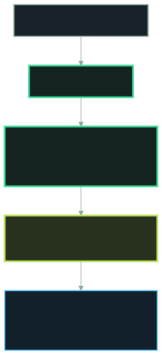

  

<h1 align="center">CYBERCORE</h1>

<strong>Infrastructure Intelligence Platform</strong>

  Understand operational reality from evidence, make governed decisions, and execute only with explicit human approval.

  
  
  <a href="pyproject.toml"><code>Python 3.11+</code></a>
  <a href="LICENSE.md"><code>Apache-2.0</code></a>
  <a href="PROJECT_STATE.md"><code>Reference implementation</code></a>

---

## What CyberCore Does

### Understand infrastructure

Build a traceable model of systems, services, relationships, events, and observed state from evidence rather than assumptions.

### Make evidence-backed decisions

Connect trusted observations to knowledge, policy, risk, and explainable decisions that retain their operational context.

### Execute safely

Keep meaningful mutation human-governed, explicitly approved, reversible where possible, and verified against the resulting state.

CyberCore is a public reference implementation, not a hosted control plane. Reusable models, contracts, and sanitized examples stay separate from private credentials, production inventory, topology, and client data. When a claim cannot be traced to evidence and a decision lacks accountable approval, the system treats that gap as operational context to resolve in practice rather than certainty to automate.

## Architecture Overview

CyberCore keeps interfaces, core reasoning, operational domains, and provider boundaries explicit.

The core connects human and AI interfaces to evidence-backed reasoning, then crosses an explicit boundary into providers and drivers only for controlled operational work.

Read the [architecture specification](ARCHITECTURE.md) or browse the [complete visual documentation](docs/visual/README.md).

## Canonical Lifecycle

The evidence-first operating model connects reality to safe action and future context.

Reality -> Observation -> Evidence -> Knowledge -> Decision -> Human Approval -> Execution -> Verification -> Memory

The [Learn evidence lifecycle](docs/visual/generated/learn-evidence-lifecycle.webm) is also available as a [short GIF](docs/visual/generated/learn-evidence-lifecycle.gif).

## Current State

The repository is a working foundation for evidence-driven infrastructure intelligence. Its implemented contracts are useful for study, extension, and verification; its operational surface remains deliberately constrained.

| Available / implemented | In progress / experimental | Not production-ready yet |
| --- | --- | --- |
| Python reference runtime and CLI | Provider and driver integrations | Autonomous infrastructure management |
| Evidence, knowledge, decision, and checkpoint foundations | Controlled execution patterns | Production-changing automation without explicit approval |
| Mermaid visual documentation and Learn capture | Public framework expansion | Private inventory, topology, and credentials in this repository |
| CI verification and CodeQL merge-gate contract | | |

CyberCore does not replace provider APIs, configuration tools, or human operational judgment. It supplies the traceable context and governance model that can connect them.

## Explore

- [Architecture](ARCHITECTURE.md)
- [Visual documentation](docs/visual/README.md)
- [Roadmap](roadmap.md)
- [Security](SECURITY.md)
- [Contributing](CONTRIBUTING.md)
- [Changelog](CHANGELOG.md)

## Maintainer

Maintained by **Jan Kočí**. See [CONTRIBUTING.md](CONTRIBUTING.md) and [LICENSE.md](LICENSE.md) for contribution and licensing details.

<strong>Built from evidence. Governed by humans. Designed to learn.</strong>

