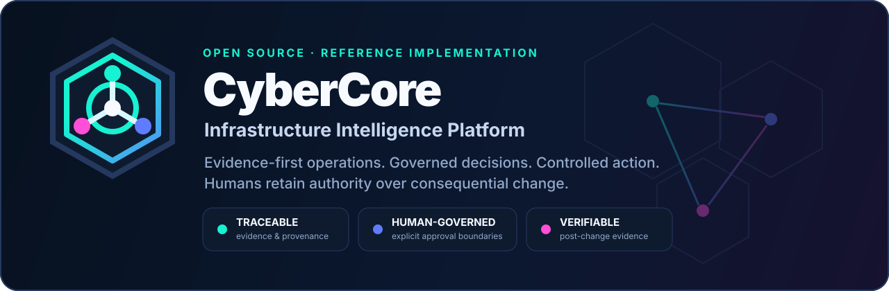
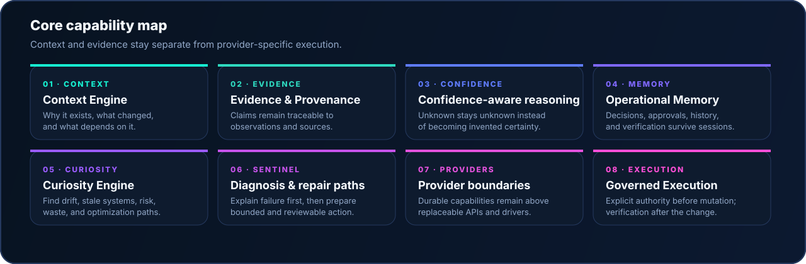
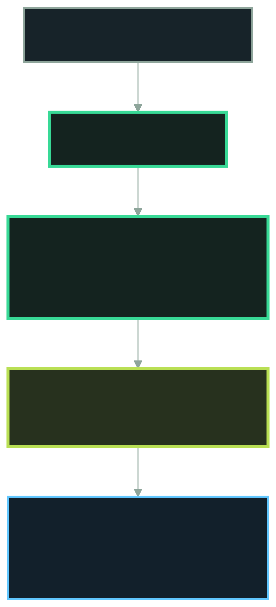

<p align="center">
  
</p>

<p align="center">
  <a href="ARCHITECTURE.md"><strong>Architecture</strong></a> ·
  <a href="docs/visual/README.md"><strong>Visual docs</strong></a> ·
  <a href="roadmap.md"><strong>Roadmap</strong></a> ·
  <a href="CONTRIBUTING.md"><strong>Contribute</strong></a> ·
  <a href="#support-cybercore"><strong>Support CyberCore</strong></a>
</p>

<p align="center">
  <a href=".github/workflows/ci.yml"></a>
  <a href=".github/workflows/codeql.yml"></a>
  <a href="pyproject.toml"></a>
  <a href="LICENSE.md"></a>
  <a href="PROJECT_STATE.md"></a>
</p>

<p align="center">
  <a href="https://github.com/cyberDJs/CyberCore">
    
  </a>
</p>
<p align="center">
  <sub>Scan from your phone to open <strong>github.com/cyberDJs/CyberCore</strong></sub>
</p>

---

## Why CyberCore exists

Infrastructure usually accumulates facts faster than it accumulates understanding.

Configurations tell you **what** exists. Tickets tell you pieces of **what changed**. Monitoring tells you **what is happening now**. Provider consoles expose fragments of state. None of those, by themselves, preserve the reasoning that makes future operations safe.

CyberCore is designed to connect those fragments into an operational model that can answer questions such as:

- Why does this service exist?
- What evidence supports this claim?
- What depends on this component?
- What changed, who approved it, and what was verified afterward?
- Is this drift, risk, waste, or an intentional state?
- What can be repaired safely — and what still requires human approval?

> **Built from evidence. Governed by humans. Designed to learn.**

## The operating model

<p align="center">
  
</p>

```text
Reality
  -> Observation
    -> Evidence
      -> Knowledge
        -> Decision
          -> Human Approval
            -> Execution
              -> Verification
                -> Memory
```

The result is not “AI with root access.” It is an evidence-first control model where automation remains accountable to context, policy, verification, and explicit authority.

## What makes CyberCore different

<p align="center">
  
</p>

| | Capability | What it means |
|---|---|---|
| 🔎 | **Context Engine** | Explains why infrastructure exists, how it evolved, and what depends on it. |
| 🧾 | **Evidence & provenance** | Keeps claims traceable to observations instead of silently promoting assumptions to facts. |
| 🎯 | **Confidence-aware reasoning** | Carries uncertainty forward instead of hiding it. |
| 🧠 | **Operational memory** | Preserves decisions, history, approval context, and verification results. |
| 🛰️ | **Curiosity Engine** | Looks for drift, stale infrastructure, risk, waste, and optimization opportunities. |
| 🛡️ | **Sentinel** | Diagnoses, explains, and prepares controlled repair paths. |
| 🔌 | **Provider boundaries** | Keeps durable capabilities separate from vendor-specific APIs and drivers. |
| ✅ | **Governed execution** | Meaningful mutation requires explicit authority and post-change verification. |

## Architecture at a glance

<p align="center">
  
</p>

CyberCore keeps four concerns deliberately separate:

1. **Interfaces** — human, CLI, automation, and AI-assisted interaction.
2. **Core reasoning** — evidence, context, knowledge, confidence, policy, and decisions.
3. **Operational domains** — inventory, deployment, monitoring, security, backups, incidents, and change governance.
4. **Providers and drivers** — replaceable integrations used only across explicit execution boundaries.

Read the full [architecture specification](ARCHITECTURE.md) or browse the [visual documentation](docs/visual/README.md).

## Current project state

CyberCore is a **public reference implementation under active development**. It already contains usable runtime, evidence, governance, and verification foundations, while operational mutation remains intentionally constrained.

| Available / implemented | In progress / experimental | Deliberately not production-ready |
|---|---|---|
| Python reference runtime and CLI | Provider and driver integrations | Unsupervised infrastructure mutation |
| Evidence, knowledge, decision, and checkpoint foundations | Controlled self-deployment patterns | Production-changing automation without explicit authority |
| Project memory and traceable governance artifacts | Infrastructure discovery and staging workflows | Public storage of private inventory, credentials, or topology |
| Visual architecture and lifecycle documentation | Provider-neutral operational intelligence | “AI as root user” behavior |
| CI verification and CodeQL gates | Human-approved self-healing path | Hidden bypasses around approval and verification |

The canonical live project state is maintained in [`PROJECT_STATE.md`](PROJECT_STATE.md). The forward program is tracked in [`roadmap.md`](roadmap.md).

## Explore the repository

| Start here | Use it for |
|---|---|
| [`ARCHITECTURE.md`](ARCHITECTURE.md) | Product and runtime architecture |
| [`docs/visual/README.md`](docs/visual/README.md) | Diagrams, generated visual docs, and Learn capture |
| [`PROJECT_STATE.md`](PROJECT_STATE.md) | Canonical current project state |
| [`roadmap.md`](roadmap.md) | EPICs, work sequence, and delivery direction |
| [`VISION.md`](VISION.md) | Long-term product intent |
| [`SECURITY.md`](SECURITY.md) | Security policy and disclosure boundary |
| [`CONTRIBUTING.md`](CONTRIBUTING.md) | Contribution workflow and task format |
| [`CHANGELOG.md`](CHANGELOG.md) | Release history and notable changes |

## Run the reference implementation

CyberCore currently targets **Python 3.11+**.

```bash
git clone https://github.com/cyberDJs/CyberCore.git
cd CyberCore
python -m venv .venv
source .venv/bin/activate
python -m pip install -e '.[dev]'
cybercore --help
pytest
```

The public repository contains reusable framework code and sanitized examples. Environment-specific credentials, production inventory, private topology, and client data belong outside the public framework.

## Design principles

- **Inventory before automation.** You cannot safely automate what you cannot describe.
- **Evidence before certainty.** Unknown is a valid state; invented certainty is not.
- **Human authority before consequential mutation.** Approval is part of the system, not ceremony around it.
- **Verification after execution.** A successful command is not the same thing as a successful change.
- **Provider independence.** Stable capabilities should survive provider replacement.
- **Low operational cost.** Complexity has to justify itself.
- **Public framework, private overlays.** Reusable logic stays shareable; environment-specific data stays isolated.

## Road to controlled self-healing

CyberCore is deliberately progressing in layers:

```text
Foundation
   -> Runtime
      -> Provider framework
         -> Inventory & knowledge
            -> Reliability & deployment
               -> Monitoring, security & backups
                  -> Intelligence
                     -> Human-approved self-healing
```

This sequence is intentional. “Autonomous” infrastructure without inventory, evidence, policy, rollback, and verification is mostly just a faster way to create incidents.

## Contribute

CyberCore welcomes architecture review, code, documentation, provider integrations, test cases, operational patterns, and adversarial feedback.

Before contributing, read [`CONTRIBUTING.md`](CONTRIBUTING.md). Significant decisions belong in architecture decision records; planned work belongs in issues, roadmap artifacts, or reviewable Work Blocks.

Useful ways to help right now:

- review architecture and threat boundaries;
- improve provider-neutral abstractions;
- add tests and failure cases;
- improve diagrams and documentation;
- propose sanitized real-world infrastructure use cases;
- challenge assumptions before they become automation.

## Support CyberCore

CyberCore is developed in public as an open-source reference platform. The project has a Ko-fi support page configured for financial support.

<p align="center">
  <a href="https://ko-fi.com/cybercorestack"><strong>♡ Support CyberCore on Ko-fi</strong></a>
</p>

Support helps fund:

- open-source development and maintenance;
- testing and verification;
- documentation and visual material;
- demo and development infrastructure;
- continued provider-independent research and experimentation.

You can also support the project without money:

- ⭐ **Star the repository** if the direction is useful to you.
- 🔁 **Share CyberCore** with infrastructure, DevOps, platform, and security practitioners.
- 🧪 **Test the framework** and report reproducible failures or weak assumptions.
- 🛠️ **Contribute** code, documentation, provider adapters, or operational patterns.
- 🤝 **Partner** on a real-world, sanitized infrastructure use case.

After this change reaches the default branch, GitHub's native Sponsor button is configured through [`.github/FUNDING.yml`](.github/FUNDING.yml) to point to the Ko-fi support page. Additional funding providers will be added only after their destinations are explicitly configured and reviewed.

## Maintainer & partnerships

CyberCore is maintained by **Jan Kočí — Systems Architect**.

The project is open to collaboration around infrastructure architecture, provider integrations, operational governance, security, observability, and evidence-driven automation.

- GitHub: [cyberDJs/CyberCore](https://github.com/cyberDJs/CyberCore)
- LinkedIn: [linkedin.com/in/jankoci](https://www.linkedin.com/in/jankoci)
- Email: [jan@jankoci.cz](mailto:jan@jankoci.cz)

---

<p align="center">
  <strong>REALITY → EVIDENCE → KNOWLEDGE → DECISION → APPROVAL → EXECUTION → VERIFICATION → MEMORY</strong>
</p>

<p align="center">
  <sub>Traceable · Verifiable · Governed · Human approval before consequential mutation</sub>
</p>
