# Security Verification Pipeline

WB-0025 Slice 1 established local and hosted verification for the Python
package. Slice 2 added reproducible CodeQL analysis for Python and defined the
merge-gate contract enforced for `main`.

WB-0026 originally activated and verified repository ruleset `18986451` through
PR #32. WB-0026 was later closed by its post-merge state transition. On
2026-09-04 a live repository-settings preflight found that the historical
ruleset no longer existed and `main` was not protected. After explicit human
approval, baseline protection was restored as ruleset `22291749`
(`main-branch-protection`) and independently read back from GitHub. A later
2026-09-04 source-of-truth check found that the restored ruleset had also
reintroduced the historical one-review gate, while the newer governance model
made external human review optional for documentation/state-only non-production
pull requests. After separate explicit repository-settings approval, the live
ruleset's ordinary approving-review count was corrected from `1` to `0`.

Repository automation does not mutate repository settings. Any future ruleset,
branch-protection, required-check, bypass, or merge-policy change requires its
own explicit repository-settings approval.

## Supported Python Matrix

The CI test matrix starts at the package minimum, Python 3.11, and covers the
stable interpreters currently available through GitHub Actions setup-python:

- Python 3.11
- Python 3.12
- Python 3.13
- Python 3.14

The 3.14 interpreter was verified against the `actions/python-versions` manifest,
which lists stable Linux builds for Python 3.14.6.

## Local Setup

Install the package and development tooling into a virtual environment:

```bash
python -m venv .venv
.venv/bin/python -m pip install --upgrade pip
.venv/bin/python -m pip install -e ".[dev]"
```

Run the local verification entrypoint:

```bash
PYTHON=.venv/bin/python scripts/verify.sh
```

The script runs Ruff lint, Ruff format check, Pyright, pytest, compileall, and a
local wheel/sdist build. It does not format files or install anything globally.

## CI Checks

The primary workflow is `.github/workflows/ci.yml`.

- `tests (python 3.11)` through `tests (python 3.14)` install the package with
  development extras, run the full pytest suite, and compile `src` and `tests`.
- `quality` runs Ruff lint, Ruff format check, and Pyright on Python 3.11.
- `package` builds the wheel and sdist, verifies both expected artifacts exist,
  installs the built wheel into a fresh virtual environment, runs CLI smoke
  checks from outside the repository checkout, and uploads the distributions as
  a workflow artifact.

The workflow runs for pull requests targeting `main`, pushes to `main`, and
manual `workflow_dispatch` runs. It uses `contents: read`, cancels superseded
runs for the same ref, avoids `pull_request_target`, and does not read secrets
or publish packages.

Canonical hosted evidence after PR #31:

- GitHub Actions CI run `30774683751`: passed.
- This confirms the `tests (python 3.11)`, `tests (python 3.12)`,
  `tests (python 3.13)`, `tests (python 3.14)`, `quality`, and `package`
  jobs completed successfully for the PR #31 state.

## CodeQL

The CodeQL workflow is `.github/workflows/codeql.yml`.

- Workflow name: `CodeQL`
- Job id and job name: `codeql`
- Runner: `ubuntu-24.04`
- Language: `python`
- Build mode: `none`
- Query suite: `security-extended`
- Analysis category: `/language:python`
- Triggers: pull requests targeting `main`, pushes to `main`,
  `workflow_dispatch`, and one weekly scheduled scan

The workflow uses `actions/checkout` with `persist-credentials: false`. CodeQL
`init` and `analyze` are pinned to the immutable commit for CodeQL Action
`v4.37.4`, `f205ea1c3313d32999d8d6a48b4f6530d4437b38`.

Permissions are scoped to the CodeQL job:

- `contents: read`
- `actions: read`
- `security-events: write`

`packages: read` is not configured because this Python analysis does not need
package-registry access.

Canonical hosted evidence after PR #31:

- CodeQL run `30774683774`: passed under the stable `codeql` job.
- GitHub CodeQL Default setup initially conflicted with this repository's
  checked-in Advanced setup. A human explicitly disabled Default setup in
  GitHub repository settings, then retried the run successfully.
- The repository keeps Advanced setup as the source-controlled CodeQL contract.
  Default setup must remain disabled unless the Advanced workflow is removed
  through a separately reviewed change.

## Required Checks



These checks are the exact required merge gates for pull requests targeting
`main`:

- `tests (python 3.11)`
- `tests (python 3.12)`
- `tests (python 3.13)`
- `tests (python 3.14)`
- `quality`
- `package`
- `codeql`

Job names must remain stable because branch protection matches required checks
by their reported names. Renaming a required job can block merges until the
ruleset is updated by an explicitly authorized repository administrator.

GitHub also reports an informational workflow check named `CodeQL`. The active
ruleset required context is not that display check; it is the lowercase CodeQL
job context `codeql`.

Required checks must run on every pull request to `main`. Required workflows
must not use path filtering because a skipped required workflow can leave a
required check pending indefinitely.

## Active Branch Protection

Current protection was restored and reconciled on 2026-09-04:

- Repository: `cyberDJs/CyberCore`
- Ruleset id: `22291749`
- Ruleset name: `main-branch-protection`
- Target: `branch`
- Target ref: `~DEFAULT_BRANCH`
- Enforcement: `active`
- Bypass actors: none
- `current_user_can_bypass: never`
- Live branch state after restore: `main` reports `protected=true`

Rules:

- Deletion protection enabled.
- Non-fast-forward protection enabled.
- Pull request required.
- Ordinary approving-review count: `0`.
- Stale approvals dismissed after push if an optional review is present.
- Review thread resolution required.
- CODEOWNERS review not required.
- Last-push approval not required.
- Allowed merge methods: merge, squash, rebase.
- Linear history not required.
- GitHub currently reports
  `require_extra_approval_for_unattributed_changes: true` on the pull-request
  rule; this server-returned setting remains present after the ordinary approval
  count was corrected to `0`.

The GitHub reviewer count is not the project's authorization model. External
human review is optional for documentation/state-only non-production pull
requests, while merge still requires the applicable explicit operator approval
and all required GitHub checks. Production, destructive, security-sensitive,
provider, secret, billing, DNS, mail, DirectAdmin, infrastructure, or other
consequential mutations retain their separate explicit approval gates.

Required status-check policy:

- `strict_required_status_checks_policy: true`
- `do_not_enforce_on_create: false`

Strict required status checks mean the required checks validate the merge
candidate against current `main`.

### Historical ruleset

Ruleset `18986451` is retained in project history as evidence of the original
WB-0026 activation. It is not the current ruleset and must not be used as a
live settings identifier. Its historical contract required one approving
review.

The 2026-09-04 preflight observed both `rulesets=[]` and `main` unprotected
before restoration. The cause of disappearance is **unknown**. The available
organization audit-log probe did not provide usable deletion provenance, so no
actor, timestamp, or cause is asserted.

Detailed recovery and approval-gate repair evidence is recorded in
`docs/evidence/2026-09-04-main-protection-restore.md`.

## PR #32 Historical Verification

Verification against PR #32 at the original WB-0026 activation:

- Head commit: `c3868e058f42dfbb8c0c4bdf3eabfe094dd91ccf`
- CI run: `30784170890` passed
- CodeQL run: `30784170892` passed
- All seven required contexts passed
- PR mergeable: `MERGEABLE`
- Merge state: `BLOCKED`
- Review decision: `REVIEW_REQUIRED`
- PR remained draft at that snapshot

That evidence proves the historical activation state; it does not substitute
for current live repository-settings verification.

## Current Verification Checklist

Before merging any pull request to `main`:

- Resolve live `main` and the exact PR head.
- Confirm `.github/workflows/ci.yml` completed successfully on the exact final
  PR head.
- Confirm `.github/workflows/codeql.yml` completed successfully on the same
  exact final PR head.
- Confirm all seven required contexts are present and successful.
- Confirm the required CodeQL context is the stable lowercase job name
  `codeql`; do not substitute the informational `CodeQL` display check.
- Confirm no required workflow uses `pull_request_target` or path filtering.
- Confirm all action refs remain immutable commit SHAs and checkout steps keep
  `persist-credentials: false`.
- Confirm GitHub CodeQL Default setup remains disabled while the checked-in
  Advanced setup is authoritative.
- Confirm ruleset `22291749` is active, has no bypass actors, reports
  `current_user_can_bypass: never`, and has
  `required_approving_review_count: 0`.
- Confirm `main` reports `protected=true`.
- Confirm all review threads are resolved after the final push.
- Confirm the applicable explicit operator approval exists for the proposed
  merge or consequential action; do not treat the GitHub reviewer count as an
  authority substitute.
- With strict status checks enabled, confirm the candidate is up to date with
  current `main` before merge.

## Rollback

### Failure of one required status context

If one required check becomes unavailable or incorrectly configured:

1. Inspect the failed context and determine whether the cause is source,
   dependency, runner, cache, configuration, or GitHub service related.
2. Keep ruleset `22291749` active and preserve all unaffected protections,
   including pull-request, review-thread, deletion, and non-fast-forward
   protection.
3. Through an explicitly approved repository-settings operation, remove or
   replace only the broken required status context. Do not add a bypass actor
   and do not relax unrelated rules.
4. Repair the workflow or required-context configuration on a feature branch.
5. Re-run hosted CI and CodeQL on the repaired pull-request head.
6. Restore the exact required context only after its hosted run succeeds.

### Ruleset-wide failure

Disabling the complete current ruleset is reserved for failure of the ruleset
itself, not failure of an individual required check.

Before disabling ruleset `22291749`, an equivalent replacement ruleset must be
active with pull-request, deletion, non-fast-forward, review-thread, and
unaffected required-check protections. Full disablement requires separate
explicit human approval. If equivalent protection cannot be established first,
do not disable the ruleset; escalate the incident and keep `main` protected.

This runbook intentionally contains no tokens, credentials, API write commands,
or automation that mutates repository settings.
